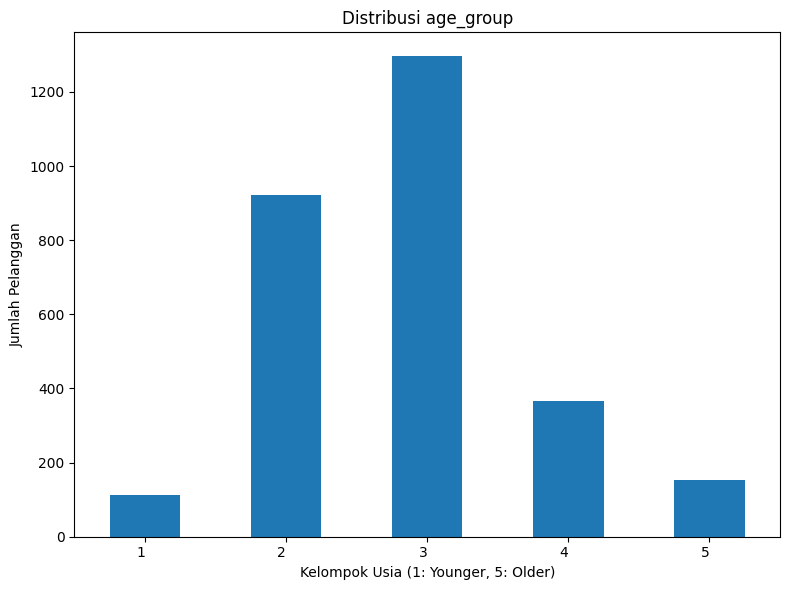
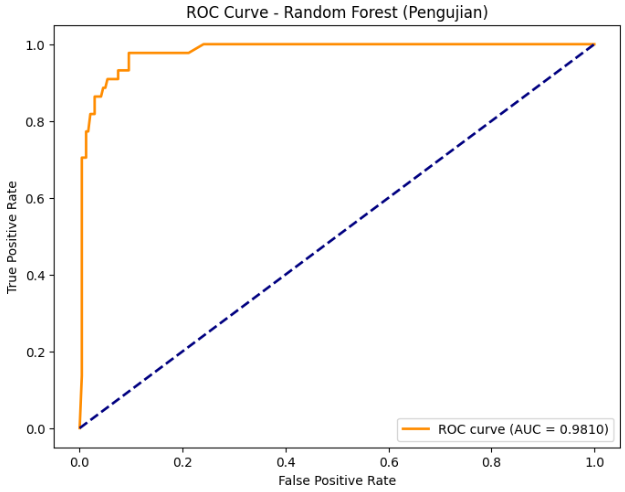

# Laporan Proyek Predictive Analytics - Reisya Junita Putri

## 1. Domain Proyek (Iranian Churn Dataset)
Landasan kesuksesan bisnis modern sangat bergantung pada pemahaman mendalam terhadap perilaku pelanggan, mulai dari upaya meningkatkan keterlibatan hingga strategi efektif untuk mengurangi *customer churn*. Dalam era digital ini, pertumbuhan eksponensial dalam jaringan komunikasi data dan kemajuan pesat Teknologi Informasi telah menghasilkan ketersediaan data pelanggan dalam skala yang belum pernah terjadi sebelumnya. Di tengah persaingan pasar yang semakin ketat, perusahaan menyadari bahwa mempertahankan pelanggan yang sudah ada seringkali jauh lebih hemat biaya dan lebih menguntungkan dibandingkan dengan mengakuisisi pelanggan baru[1].

Masalah *customer churn* menjadi krusial untuk diselesaikan karena dampaknya langsung terhadap pendapatan, profitabilitas, dan pertumbuhan jangka panjang perusahaan.[1] Tingkat *churn* yang tinggi tidak hanya mengurangi basis pelanggan tetapi juga memerlukan investasi berkelanjutan dalam upaya pemasaran dan akuisisi. Lebih lanjut, pelanggan yang tidak puas dan akhirnya *churn* berpotensi menyebarkan sentimen negatif yang dapat merusak reputasi merek. Dalam konteks industri telekomunikasi yang sangat dinamis dan kompetitif, di mana pelanggan memiliki banyak pilihan layanan, kemampuan untuk meminimalkan *churn* menjadi keunggulan kompetitif yang signifikan.[2]

Untuk mengatasi tantangan *churn*, pendekatan tradisional yang reaktif seringkali tidak memadai. Di sinilah *Machine Learning* (ML) menawarkan solusi yang revolusioner. Dengan kemampuannya untuk menganalisis volume data yang besar dan mengidentifikasi pola-pola kompleks yang mungkin terlewatkan oleh analisis manual, ML memungkinkan perusahaan untuk memprediksi pelanggan mana yang memiliki kemungkinan tinggi untuk *churn* di masa depan. [2]

Secara konkret, proyek ini berfokus pada pengembangan model prediksi *customer churn* menggunakan algoritma *machine learning* dan dataset Iranian Churn. Dataset ini menyediakan berbagai fitur relevan yang mencakup demografi pelanggan, pola penggunaan layanan, riwayat interaksi, dan informasi akun. Dengan menganalisis data historis ini, model klasifikasi *machine learning* akan dibangun untuk menetapkan probabilitas *churn* bagi setiap pelanggan. Informasi prediktif ini akan memberdayakan perusahaan telekomunikasi untuk mengambil tindakan proaktif dan terukur, seperti menawarkan insentif yang dipersonalisasi, meningkatkan kualitas layanan, atau menyelesaikan masalah pelanggan sebelum mereka memutuskan untuk beralih ke pesaing. Implementasi model prediksi *churn* yang akurat diharapkan dapat menghasilkan peningkatan signifikan dalam retensi pelanggan, optimasi biaya pemasaran, dan peningkatan kepuasan pelanggan secara keseluruhan.

## 2. Business Understanding

Pada tahap ini, fokus utama adalah memahami konteks bisnis dan merumuskan tujuan analisis prediksi *churn* pelanggan secara menyeluruh. Pemahaman yang kuat terhadap permasalahan bisnis akan memandu proses analisis data dan pengembangan model prediktif yang tepat sasaran.

### 2.1. Business Objectives
*Churn* pelanggan merupakan salah satu tantangan besar dalam industri jasa dan layanan. Kehilangan pelanggan secara berkelanjutan tidak hanya berdampak pada pendapatan, tetapi juga meningkatkan biaya akuisisi pelanggan baru. Oleh karena itu, perusahaan perlu memahami pola-pola yang menyebabkan *churn* dan merancang strategi retensi yang efektif berdasarkan data.

Proyek ini bertujuan untuk membangun sistem prediksi *churn* pelanggan berbasis *machine learning* dengan tujuan utama membantu perusahaan dalam mengidentifikasi pelanggan yang berisiko *churn* serta memahami faktor-faktor utama yang memengaruhinya. Dengan demikian, perusahaan dapat melakukan intervensi secara proaktif untuk mengurangi tingkat churn dan meningkatkan retensi pelanggan.

### 2.2. Problem Statements

Berikut adalah beberapa permasalahan utama yang menjadi fokus dalam proyek ini:

1.  **Bagaimana cara mengidentifikasi pelanggan yang memiliki kemungkinan besar untuk berhenti menggunakan layanan (*churn*) di masa mendatang?**

2.  **Faktor-faktor apa saja yang paling berpengaruh terhadap keputusan pelanggan untuk melakukan *churn*?**

3.  **Bagaimana model prediksi *churn* dapat dimanfaatkan untuk merancang strategi retensi pelanggan yang efektif dan mengurangi tingkat *churn*?**

### 2.3. Goals

Tujuan dari proyek ini adalah untuk menjawab permasalahan-permasalahan di atas, yaitu:

1.  Mengembangkan model *machine learning* yang akurat untuk memprediksi probabilitas *churn* pelanggan di masa mendatang.

2.  MMengidentifikasi dan menganalisis pola-pola awal dalam data yang berpotensi menjadi faktor churn melalui Eksplorasi Data (EDA).

3.  Memberikan rekomendasi strategi retensi pelanggan berdasarkan hasil analisis prediksi dan wawasan awal dari data.

### 2.4. Solution Statements
Untuk mencapai tujuan-tujuan tersebut, proyek ini akan menerapkan solusi-solusi berikut:
1.  **Pemodelan Prediktif dengan Machine Learning**
    * Membangun dan mengevaluasi berbagai model klasifikasi (seperti *Logistic Regression*, SVM, K-Nearest Neighbors, *Random Forest*).
    * Menggunakan metrik evaluasi seperti *accuracy*, *precision*, *recall*, dan F1-*score* untuk menilai performa model dalam **prediksi churn**.

2.  **Analisis Awal Faktor-Faktor Churn melalui EDA**
    - Melakukan eksplorasi data untuk mengidentifikasi pola-pola penting yang berkaitan dengan *churn* melalui visualisasi dan statistik deskriptif.

## 3. Data Understanding
Dataset yang digunakan dalam proyek ini adalah Iranian Churn Dataset, yang dapat diunduh dari [UCI Machine Learning Repository](https://archive.ics.uci.edu/dataset/563/iranian+churn+dataset).

### 3.1. Variabel-variabel pada Iranian Churn dataset adalah sebagai berikut:

| Attribute               | Description                                             | Data Type |
|-------------------------|---------------------------------------------------------|-----------|
| Anonymous Customer ID   | Unique identifier for each customer (anonymized)        | -         |
| Call Failures            | Number of call failures                                 | int64     |
| Complains               | Binary (0: No complaint, 1: Complaint)                  | int64     |
| Subscription Length     | Total months of subscription                            | int64     |
| Charge Amount           | Ordinal attribute (0: Lowest amount, 10: Highest)       | int64     |
| Seconds of Use          | Total seconds of calls                                  | int64     |
| Frequency of Use        | Total number of calls                                   | int64     |
| Frequency of SMS        | Total number of text messages                           | int64     |
| Distinct Called Numbers | Total number of distinct phone numbers called           | int64     |
| Age Group               | Ordinal (1: Younger age, 5: Older age)                  | int64     |
| Tariff Plan             | Binary (1: Pay as you go, 2: Contractual)               | int64     |
| Status                  | Binary (1: Active, 2: Non-active)                       | int64     |
| Age                     | Age of customer in years                                | int64     |
| Customer Value          | The calculated value of the customer                   | float64   |
| Churn                   | Binary (1: Churn, 0: Non-churn) - Class label           | int64     |

Tabel 3.1. Variabel Dataset

### 3.2. Informasi Dataset Iranian Churn:
* **Dataset awal** memiliki **3150** data dan 14 kolom
* Dataset memiliki **2850** data dan 14 kolom (**setelah penghapusan duplikat**)
* Tidak terdapat *Missing Values*
* Terdapat perbedaan jenis tipe data (*complains*, *charge amount*, *age group*, *tariff plan*, *status*, *churn*) akan diubah menjadi tipe data **category**

### 3.3. Exploratory Data Analysis
Tahap *Exploratory Data Analysis* (EDA) bertujuan untuk memahami karakteristik utama dataset Iranian Churn sebelum dilakukan pemodelan. Melalui serangkaian teknik visualisasi dan analisis statistik, EDA membantu dalam mengidentifikasi pola, anomali, hubungan antar variabel, serta potensi masalah kualitas data yang dapat mempengaruhi kinerja model prediksi.

#### 3.3.1. Deskripsi Variabel
### Statistik Deskriptif Iranian Churn Dataset:

| Fitur                      | count    | unique | top   | freq   | mean        | std          | min  | 25%       | 50%       | 75%       | max         |
|---------------------------|----------|--------|-------|--------|-------------|--------------|------|-----------|-----------|-----------|-------------|
| call\_failure             | 2850.0   | NaN    | NaN   | NaN    | 7.02456     | 7.262172     | 0.0  | 1.00      | 6.00      | 12.00     | 36.00       |
| complains                 | 2850.0   | 2.0    | 0.0   | 2620.0 | NaN         | NaN          | NaN  | NaN       | NaN       | NaN       | NaN         |
| subscription\_length      | 2850.0   | NaN    | NaN   | NaN    | 32.452982   | 8.723075     | 3.0  | 29.00     | 35.00     | 39.00     | 47.00       |
| charge\_amount            | 2850.0   | 11.0   | 0.0   | 1575.0 | NaN         | NaN          | NaN  | NaN       | NaN       | NaN       | NaN         |
| seconds\_of\_use          | 2850.0   | NaN    | NaN   | NaN    | 4534.243158 | 4199.712303  | 0.0  | 1458.7500 | 3041.0000 | 6500.0000 | 17090.0000 |
| frequency\_of\_use        | 2850.0   | NaN    | NaN   | NaN    | 70.484912   | 57.401512    | 0.0  | 26.00     | 54.50     | 96.00     | 255.00      |
| frequency\_of\_sms        | 2850.0   | NaN    | NaN   | NaN    | 73.769825   | 112.062397   | 0.0  | 7.00      | 22.00     | 88.00     | 522.00      |
| distinct\_called\_numbers | 2850.0   | NaN    | NaN   | NaN    | 23.870526   | 17.193929    | 0.0  | 11.00     | 21.00     | 34.00     | 97.00       |
| age\_group                | 2850.0   | 5.0    | 3.0   | 1296.0 | NaN         | NaN          | NaN  | NaN       | NaN       | NaN       | NaN         |
| tariff\_plan              | 2850.0   | 2.0    | 1.0   | 2162.0 | NaN         | NaN          | NaN  | NaN       | NaN       | NaN       | NaN         |
| status                    | 2850.0   | 2.0    | 1.0   | 2160.0 | NaN         | NaN          | NaN  | NaN       | NaN       | NaN       | NaN         |
| age                       | 2850.0   | NaN    | NaN   | NaN    | 31.077193   | 8.619394     | 15.0 | 25.00     | 30.00     | 37.00     | 55.00       |
| customer\_value           | 2850.0   | NaN    | NaN   | NaN    | 474.998367  | 514.442198   | 0.0  | 117.527500| 232.520000| 790.000000| 2165.280000 |
| churn                     | 2850.0   | 2.0    | 0.0   | 2410.0 | NaN         | NaN          | NaN  | NaN       | NaN       | NaN       | NaN         |

Tabel 3.2. Statistik Deskriptif

Tabel di atas menyajikan ringkasan statistik deskriptif untuk setiap kolom dalam dataset Iranian Churn. Statistik ini memberikan gambaran awal tentang distribusi setiap fitur seperti rentang nilai, nilai tengah, dan sebaran data. Perbandingan nilai min, max, dan kuartil dapat memberikan indikasi adanya potensi *outlier* dalam fitur-fitur numerik (nilai yang jauh dari sebagian besar data). pada kolom *churn*, terlihat bahwa '0.0' (tidak *churn*) memiliki frekuensi yang jauh lebih tinggi (2410) dibandingkan dengan nilai '1.0' (*churn*), yang mengindikasikan adanya ketidakseimbangan kelas target. Informasi ini sangat berguna untuk memahami dataset secara keseluruhan sebelum melakukan visualisasi lebih lanjut atau membangun model *machine learning*.

#### 3.3.2. Pengecekan Missing Value
Dilakukannya pengecekan ini, untuk memastikan tidak adanya nilai yang hilang atau missing values.

  
| No. | Fitur                    | Jumlah Missing Value |
|-----|--------------------------|-----------------------|
| 1   | call_failure             | 0                     |
| 2   | complains                | 0                     |
| 3   | subscription_length      | 0                     |
| 4   | charge_amount            | 0                     |
| 5   | seconds_of_use           | 0                     |
| 6   | frequency_of_use         | 0                     |
| 7   | frequency_of_sms         | 0                     |
| 8   | distinct_called_numbers  | 0                     |
| 9   | age_group                | 0                     |
| 10  | tariff_plan              | 0                     |
| 11  | status                   | 0                     |
| 12  | age                      | 0                     |
| 13  | customer_value           | 0                     |
| 14  | churn                    | 0                     |

Tabel 3.3. Total Missing Values

Dari tabel total missing value di atas, dapat dilihat **tidak terdapat nilai yang hilang atau missing value (0)**.

#### 3.3.3. Pengecekan Duplikasi Data
Dilakukannya pengecekan ini, untuk memastikan tidak adanya data yang terduplikasi. 
- Sebanyak **300 baris data duplikat** teridentifikasi dalam dataset awal.
- Data duplikat adalah baris-baris yang memiliki nilai yang identik di semua kolom. Keberadaannya dapat menyebabakan bias dalam analisis dan pemodelan machine learning karena representasi pola dalam data menjadi berlebihan.
- Untuk mengatasi hal ini, **data duplikat telah dihapus** dari dataset. Proses penghapusan duplikasi menghasilkan dataset yang lebih bersih dan representatif.
- Setelah penghapusa, tidak ada lagi indikasi adanya data duplikat dalam dataset.

#### 3.3.4. Pengecekan Outliers

Gambar 3.1. Pengecekan Outliers

Dilakukannya pengecekan ini, untuk mengidentifikasi potensi nilai ekstrem (outlier) dalam fitur numerik, yang kemudian ditangani menggunakan metode IQR. Penangan outlier penting untuk mengurangi dampak nilai ekstrem pada model.

#### 3.3.5. Univariate Analysis
Analisis univariate dilakukan untuk memahami distribusi setiap fitur secara individual. Berikut adalah analisis untuk beberapa fitur:

**Fitur 'complains'**

Gambar 3.2. Fitur Complains

  - Analisis terhadap fitur 'complains' menunjukkan distribusi tidak seimbang antara pelanggan yang mengajukan keluhan dan yang tidak.
  - Sebanyak **2620 pelanggan (91.9%)** tidak mengajukan keluhan, sedangkan hanya **230 pelanggan (8.1%)** yang mengajukan keluhan.
  - Ketidakseimbangan ini mengindikasikan bahwa sebagian besar pelanggan mungkin puas atau tidak memiliki masalah yang dilaporkan. Namun, kelompok kecil pelanggan yang mengajukan keluhan, penting untuk diperhatikan karena dapat menjadi indikator risiko churn. 

**Fitur 'charge_amount'**

Gambar 3.3. Fitur Charge Amount

  - Fitur 'charge_amount' merupakan atribut ordinal dengan skala 0 (terendah) hingga 10 (tertinggi), yang merepresentasikan besaran biaya yang dikenakan kepada pelanggan.
  - Distribusi pelanggan berdasarkan tingkat biaya menunjukkan bahwa mayoritas pelanggan berada pada tingkat biaya 0, dengan jumlah mencapai **1575 pelanggan (55.3%)**.
  - Jumlah pelanggan secara signifikan menurun seiring dengan meningkatnya tingkat biaya. Tingkat biaya 1 memiliki 559 pelanggan (19.6%), tingkat biaya 2 memiliki 362 pelanggan (12.7%), dan seterusnya. Tingkat biaya tertinggi (10) hanya memiliki 7 pelanggan (0.2%).
  - Distribusi ini mengindikasikan bahwa sebagian besar pelanggan menggunakan layanan dengan tingkat biaya yang lebih rendah. Informasi ini dapat berguna untuk memahami sensitivitas pelanggan terhadap harga dan merancang strategi penetapan harga atau promosi yang sesuai. Penurunan jumlah pelanggan pada tingkat biaya yang lebih tinggi juga dapat menjadi pertimbangan dalam analisis churn terkait dengan biaya layanan.

**Fitur 'age_group'**

  

Gambar 3.4. Fitur Age Group

- Fitur 'age_group' merupakan atribut ordinal dengan skala 1 (lebih muda) hingga 5 (lebih tua), yang mengkategorikan kelompok usia pelanggan.
- Distribusi pelanggan berdasarkan kelompok usia menunjukkan bahwa kelompok usia 3 memiliki jumlah pelanggan terbanyak, yaitu **1296 pelanggan (45.5%)**.
- Kelompok usia 2 juga memiliki jumlah pelanggan yang cukup signifikan, yaitu **921 pelanggan (32.3%)**.
- Jumlah pelanggan cenderung lebih rendah pada kelompok usia yang lebih muda (kelompok 1 dengan **112 pelanggan (3.9%))** dan kelompok usia yang lebih tua (kelompok 4 dengan 367 pelanggan (12.9%) dan kelompok 5 dengan **154 pelanggan (5.4%))**.
- Distribusi ini memberikan gambaran tentang demografi usia pelanggan. Mayoritas pelanggan berada di kelompok usia menengah (kelompok 2 dan 3). Informasi ini dapat berguna untuk menyesuaikan strategi pemasaran dan layanan dengan kelompok usia pelanggan yang dominan. Perbedaan jumlah pelanggan antar kelompok usia juga dapat menjadi faktor yang relevan dalam analisis churn.

**Fitur 'tariff_plan'**

Gambar 3.5. Fitur Tariff Plan

- Fitur 'tariff_plan' merupakan fitur biner yang mengindikasikan jenis paket tarif yang digunakan pelanggan, dengan kategori 'pay as you go' dan 'contractual'.
- Distribusi pelanggan berdasarkan paket tarif menunjukkan bahwa mayoritas besar pelanggan menggunakan skema **'pay as you go'**, dengan jumlah mencapai **2621 pelanggan (92.0%)**.
- Hanya sebagian kecil pelanggan yang menggunakan paket **'contractual'**, yaitu sebanyak **229 pelanggan (8.0%)**.
- Mayoritas pelanggan memilih skema 'pay as you go'. Informasi ini penting untuk memahami preferensi pelanggan terhadap model pembayaran dan dapat mempengaruhi strategi pemasaran serta penawaran produk. Perbedaan signifikan dalam jumlah pelanggan antar jenis paket tarif juga dapat menjadi faktor yang relevan dalam analisis churn. Pelanggan dengan paket 'contractual' mungkin memiliki karakteristik churn yang berbeda dibandingkan dengan pelanggan 'pay as you go'.

**Fitur 'Status'**

Gambar 3.6. Fitur Status

- Fitur 'status' merupakan fitur biner yang mengindikasikan status keaktifan pelanggan, dengan kategori 'active' dan 'non active'.
-  Distribusi pelanggan berdasarkan status menunjukkan bahwa mayoritas pelanggan berstatus **'active'**, dengan jumlah mencapai **2166 pelanggan (76.0%)**.
-  Sebagian pelanggan lainnya berstatus **'non active'**, yaitu sebanyak **684 pelanggan (24.0%)**.
-  Sebagian besar pelanggan dalam dataset berstatus aktif. Namun, jumlah pelanggan yang tidak aktif juga cukup signifikan. Status keaktifan ini kemungkinan besar memiliki korelasi yang kuat dengan target variabel 'churn' dan menjadi indikator penting dalam prediksi. Perbedaan proporsi ini perlu dipertimbangkan dalam analisis lebih lanjut dan pemodelan.

**Fitur 'Churn'**

Gambar 3.7. Churn

- Fitur 'churn' adalah variabel target biner yang mengindikasikan apakah seorang pelanggan berhenti menggunakan layanan (churn) atau tidak. Kategori 0 merepresentasikan 'non-churn' dan kategori 1 merepresentasikan 'churn'.
- Distribusi pelanggan berdasarkan status churn menunjukkan bahwa mayoritas pelanggan **tidak melakukan churn ('non-churn')**, dengan jumlah mencapai **2404 pelanggan (84.4%)**.
- Sebagian kecil pelanggan **melakukan churn ('churn')**, yaitu sebanyak **446 pelanggan (15.6%)**.
- Dataset ini memiliki masalah ketidakseimbangan kelas target, di mana jumlah pelanggan yang tidak churn jauh lebih banyak daripada pelanggan yang churn. Ketidakseimbangan kelas ini penting untuk diperhatikan dalam pemilihan metrik evaluasi model dan strategi pemodelan. Model yang hanya berfokus pada akurasi mungkin memberikan hasil yang menyesatkan jika tidak mempertimbangkan kinerja pada kelas minoritas ('churn'). Teknik penanganan ketidakseimbangan kelas mungkin diperlukan untuk membangun model yang baik dalam memprediksi pelanggan yang akan churn.

**Fitur Numerik**

Gambar 3.8. Fitur Numerik

**Distribusi `call_failure`:**
- Histogram menunjukkan sebagian besar pelanggan memiliki jumlah call failure yang rendah (sekitar 0–5).
- Distribusi menunjukkan positive skew, dengan sebagian kecil pelanggan mengalami jumlah call failure yang sangat tinggi.
- Ini mengindikasikan bahwa layanan berjalan lancar bagi mayoritas pelanggan, namun ada sebagian kecil yang mungkin mengalami masalah jaringan.

**Distribusi `subscription_length`:**
- Distribusi memiliki puncak utama di rentang 30–40 bulan, menunjukkan banyak pelanggan dengan masa berlangganan menengah hingga panjang.
- Terdapat puncak sekunder pada masa berlangganan awal (di bawah 10 bulan).
- Menunjukkan adanya dua kelompok pelanggan: pelanggan baru dan pelanggan dengan loyalitas yang lebih tinggi.
- Distribusi cenderung simetris atau sedikit negatively skewed karena penumpukan pada nilai yang lebih tinggi.

**Distribusi `seconds_of_use`:**
- Distribusi sangat positively skewed, dengan sebagian besar pelanggan memiliki total durasi panggilan di bawah 5000 detik.
- Ekor panjang ke kanan mengindikasikan adanya pelanggan dengan penggunaan sangat tinggi.
- Mayoritas pelanggan adalah pengguna dengan volume panggilan sedang, sementara sebagian kecil merupakan pengguna berat.

**Distribusi `frequency_of_use`:**
- Distribusi positively skewed dengan puncak utama pada frekuensi penggunaan rendah (0–50 panggilan).
- Ekor panjang menunjukkan adanya pelanggan dengan frekuensi panggilan yang sangat tinggi.
- Sebagian besar pelanggan tidak terlalu sering melakukan panggilan, namun ada sejumlah kecil pengguna yang sangat aktif.

**Distribusi `frequency_of_sms`:**
- Distribusi sangat positively skewed, dengan sebagian besar pelanggan mengirim sejumlah kecil pesan SMS.
- Ekor yang sangat panjang mengindikasikan adanya pelanggan yang mengirim SMS dalam volume besar.
- Penggunaan SMS didominasi oleh volume rendah, dengan beberapa pengguna yang sangat aktif mengirim pesan.

**Distribusi `distinct_called_numbers`:**
- Distribusi unimodal dengan puncak di sekitar 10–30 nomor telepon yang berbeda.
- Ekor panjang ke kanan menunjukkan beberapa pelanggan menghubungi banyak nomor berbeda.
- Sebagian besar pelanggan cenderung berkomunikasi dengan sejumlah kontak yang terbatas.
- Distribusi cenderung positively skewed.

**Distribusi `age`:**
- Distribusi menunjukkan beberapa puncak, terutama di sekitar usia 25–35 tahun, mengindikasikan kelompok usia pelanggan yang dominan.
- Basis pelanggan cenderung terkonsentrasi pada kelompok usia dewasa muda hingga dewasa menengah.
- Distribusi ini terlihat multimodal dan sedikit positively skewed karena adanya ekor lebih panjang ke arah usia lebih tinggi.

**Distribusi `customer_value`:**
- Distribusi sangat positively skewed, dengan sebagian besar pelanggan memiliki nilai pelanggan yang relatif rendah.
- Ekor panjang ke kanan menunjukkan sejumlah kecil pelanggan dengan customer value tinggi bagi perusahaan.
- Sebagian besar pendapatan mungkin berasal dari sejumlah kecil pelanggan bernilai tinggi.

 #### 3.3.6. Multivariate Analysis
 **Analisis Multivariate - Korelasi Fitur Numerik**
 

 

Gambar 3.9. Heatmap Korelasi Fitur Numerik

Heatmap di atas (Gambar 3.9. Heatmap Korelasi Fitur Numerik) secara visual menampilkan matriks korelasi antar fitur-fitur numerik dalam dataset. Warna dan angka di setiap sel menunjukkan kekuatan dan arah korelasi (antara -1 dan 1). Warna merah menunjukkan korelasi positif, warna biru menunjukkan korelasi negatif, dan warna mendekati putih menunjukkan korelasi yang lemah atau tidak ada. Angka di setiap sel adalah koefisien korelasi Pearson.

- Korelasi Positif Kuat:
  - Terdapat korelasi positif yang sangat kuat antara **seconds_of_use** dan **frequency_of_use** (**0.95**). Ini menunjukkan bahwa pelanggan yang lebih sering menggunakan layanan cenderung memiliki durasi panggilan yang lebih lama.
  - Terdapat korelasi positif yang cukup kuat antara **frequency_of_sms** dan **customer_value** (**0.92**). Ini mengindikasikan bahwa pelanggan yang lebih sering mengirim SMS cenderung memiliki nilai pelanggan yang lebih tinggi.
  - **distinct_called_numbers** juga memiliki korelasi positif yang moderat dengan **seconds_of_use** (**0.67**) dan **frequency_of_use** (**0.73**), menunjukkan bahwa pelanggan dengan lebih banyak nomor unik yang dihubungi cenderung memiliki durasi panggilan yang lebih lama dan frekuensi panggilan yang lebih tinggi.
  - **call_failure** berkorelasi positif sedang dengan **frequency_of_use** (**0.57**) dan **seconds_of_use** (**0.50**), yang mungkin mengindikasikan bahwa semakin sering pelanggan menggunakan layanan atau semakin lama durasinya, semakin besar kemungkinan mereka mengalami kegagalan panggilan.

- Korelasi Positif Lemah:
  - Sebagian besar pasangan fitur numerik lainnya menunjukkan korelasi positif yang lemah.

- Korelasi Negatif Lemah:
  - **age** menunjukkan korelasi negatif yang lemah dengan **customer_value** (**-0.23**), yang mungkin mengindikasikan tren yang sangat lemah di mana pelanggan yang lebih tua cenderung memiliki nilai pelanggan yang sedikit lebih rendah.

- Korelasi Mendekati Nol:
  - Beberapa pasangan fitur menunjukkan korelasi yang sangat lemah atau mendekati nol, seperti antara **call_failure** dan **frequency_of_sms** (**-0.032**), atau antara **age** dan **subscription_length** (**0.0059**).

 **Analisis Multivariate - Pairplot Fitur Numerik**
  

Gambar 3.10. Pairplot Fitur Numerik

- Distribusi Univariat (Diagonal):
  - Seperti yang kita bahas sebelumnya, visualisasi pada diagonal memberikan gambaran tentang **distribusi setiap fitur numerik** (skewness, multimodalitas, dll.).

- Hubungan Bivariat (Off-Diagonal):
  - **'seconds_of_use' vs 'frequency_of_use'**: Terlihat adanya korelasi positif yang sangat kuat dan cenderung **linear**. Semakin sering pelanggan menggunakan layanan, semakin tinggi total durasi penggunaannya.
  - **'distinct_called_numbers' vs 'seconds_of_use' dan 'frequency_of_use'**: Tampak adanya korelasi positif yang **moderat**. Pelanggan yang menghubungi lebih banyak nomor yang berbeda cenderung memiliki durasi penggunaan dan frekuensi penggunaan yang lebih tinggi.
  - **'customer_value' vs 'frequency_of_sms'**: Terdapat indikasi korelasi **positif**. Pelanggan dengan **customer value** yang lebih tinggi cenderung mengirim lebih banyak SMS.
  - **'call_failure' vs 'frequency_of_use' dan 'seconds_of_use'**: Ada indikasi korelasi **positif yang lemah atau sedang**. Semakin sering atau semakin lama pelanggan menggunakan layanan, kemungkinan mengalami kegagalan panggilan sedikit meningkat.
  - **'subscription_length' dengan fitur lain**: Tidak terlihat adanya korelasi linear yang sangat kuat dengan fitur numerik lainnya.
  - **'age' dengan fitur lain**: Sebagian besar scatter plot yang melibatkan **'age'** menunjukkan sebaran titik yang relatif **acak**, mengindikasikan **korelasi linear yang lemah**. Namun, perlu diperhatikan apakah ada pola **non-linear** atau pengelompokan berdasarkan usia pada scatter plot dengan fitur lain.

- Pola Non-Linear atau Pengelompokan:
  - Perhatikan apakah ada pola **non-linear** (misalnya, berbentuk kurva) dalam scatter plot atau adanya kelompok-kelompok data yang terpisah. Ini bisa memberikan insight tentang **segmen pelanggan yang berbeda**.

- Potensi Outlier Bivariat:
  - Amati titik-titik yang terletak **jauh dari kerumunan utama** pada setiap scatter plot, karena ini bisa menjadi indikasi **outlier multivariat**.

## 4. Data Preparation
Setelah tahap pemahaman dan eksplorasi data, langkah selanjutnya adalah Data Preparation. Tahap ini bertujuan untuk mempersiapkan data agar sesuai dan optimal untuk proses pemodelan machine learning.

### 4.1. Penanganan Outliers

Gambar 4.1. Penanganan Outliers

Gambar di atas menampilkan boxplot untuk beberapa fitur numerik setelah proses penanganan outlier menggunakan metode IQR capping. Visualisasi ini menunjukkan distribusi data setelah nilai-nilai ekstrem di luar batas IQR disesuaikan.

Penjelasan untuk masing-masing fitur:

- call_failure: Outlier di-capped pada [-15.50, 28.50] (IQR Method).
- subscription_length: Outlier di-capped pada [15.50, 51.50] (IQR Method).
- seconds_of_use: Outlier di-capped pada [-6103.12, 14061.88] (IQR Method).
- frequency_of_use: Outlier di-capped pada [-74.00, 198.00] (IQR Method).
- frequency_of_sms: Outlier di-capped pada [-114.50, 209.50] (IQR Method).
- distinct_called_numbers: Outlier di-capped pada [-23.50, 68.50] (IQR Method).
- age: Outlier di-capped pada [17.50, 37.50] (IQR Method).
- customer_value: Outlier di-capped pada [-891.30, 1798.91] (IQR Method).

Penanganan outlier ini bertujuan untuk mengurangi pengaruh nilai ekstrem terhadap proses pelatihan model, sehingga menghasilkan model yang lebih stabil dan akurat.

### 4.2. Menghapus Kolom yang Tidak Dibutuhkan
- **Tujuan**: Menghilangkan fitur-fitur yang dianggap **tidak relevan**, **redundan**, atau berpotensi menimbulkan masalah seperti **multicollinearity**.

- **Kolom yang Dihapus**: 'seconds_of_use' dan 'frequency_of_sms', karena keduanya memiliki **korelasi sangat tinggi** dengan fitur lain ('frequency_of_use' dan 'customer_value'), yang dapat menyebabkan **overfitting atau bias model**.

### 4.3. Encoding Fitur Kategori
- **Tujuan**: Mengubah fitur-fitur kategorikal menjadi format numerik yang dapat dipahami oleh sebagian besar algoritma machine learning.

- **Metode**: menggunakan One-Hot Encoding untuk fitur 'complains', 'tariff_plan', 'status', dan 'churn'. Setiap kategori dalam fitur nominal diubah menjadi kolom biner baru (0 atau 1).

### 4.4. Feature Scaling
- **Tujuan**: Menstandarisasi skala fitur-fitur numerik agar memiliki **rata-rata 0** dan **deviasi standar 1**. Ini penting untuk algoritma yang **sensitif terhadap skala fitur** seperti **SVM** dan **KNN**, serta membantu algoritma lain untuk **lebih cepat konvergen**.

- **Metode**: Menggunakan **StandardScaler** dari `sklearn.preprocessing`.

- **Fitur yang Di-scale**: Semua **kolom numerik** setelah encoding, **kecuali kolom biner hasil one-hot encoding**.

### 4.5. Penanganan Ketidakseimbangan Kelas

**Tujuan:**  
Mengatasi masalah ketidakseimbangan kelas pada variabel target (`churn`), di mana jumlah pelanggan yang tidak churn jauh lebih banyak daripada yang churn. Model yang dilatih pada data yang tidak seimbang cenderung bias terhadap kelas mayoritas.

**Metode yang Digunakan:**  
Teknik oversampling dengan **SMOTE** (Synthetic Minority Over-sampling Technique) telah diterapkan pada data latih. SMOTE bekerja dengan membuat sampel sintetis baru untuk kelas minoritas dengan cara menginterpolasi antara sampel-sampel yang ada di kelas minoritas.

**Implementasi:**  
- SMOTE diimplementasikan setelah pembagian data menjadi data latih, data validasi, dan data uji.
- Penanganan nilai NaN menggunakan `SimpleImputer` dilakukan terlebih dahulu.
- Penerapan SMOTE dilakukan **hanya pada data latih** (`X_train` dan `y_train`) untuk menghindari kebocoran informasi ke data validasi atau data uji.

### 4.6. Train-Test-Split
- **Tujuan**: Membagi dataset menjadi **set pelatihan** untuk membangun model, **set validasi** untuk pemilihan model dan hyperparameter, dan **set pengujian** untuk evaluasi akhir yang tidak bias.

- **Rasio Pembagian**: 
  - **80%** untuk pelatihan
  - **10%** untuk validasi (**50% dari 20% sementara**)
  - **10%** untuk pengujian (**50% dari 20% sementara**)

- **Stratifikasi**: Menggunakan `stratify=y` untuk memastikan **proporsi kelas target (churn dan non-churn)** tetap sama di semua subset.

- **Random State**: `random_state=42` digunakan untuk memastikan **pembagian data yang konsisten** setiap kali kode dijalankan.

## 5. Modeling

Tahap modeling adalah inti dari proyek ini, di mana berbagai algoritma machine learning diterapkan untuk membangun model prediksi churn pelanggan.

### 5.1. Pemilihan Model

Beberapa algoritma klasifikasi telah dipilih dan akan dievaluasi untuk menemukan model yang paling baik dalam memprediksi churn. Model-model tersebut meliputi:

#### **Model 1: Logistic Regression (Default Parameters)**  
  **Logistic Regression** adalah algoritma klasifikasi linear yang digunakan untuk memprediksi probabilitas dari hasil biner (misalnya, ya/tidak atau 0/1). Meskipun namanya mengandung kata "regresi", algoritma ini digunakan untuk klasifikasi, bukan untuk regresi nilai kontinu.

  Cara kerja Logistic Regression melibatkan beberapa langkah:
1. **Input**: 
   - Algoritma menerima fitur-fitur input (misalnya, fitur-fitur pelanggan yang telah diproses).

2. **Kombinasi Linear**:
   - Fitur-fitur input dikombinasikan secara linear menggunakan bobot (koefisien) yang dipelajari saat training.
   
   Rumus kombinasinya:

   $$
   z = b_0 + b_1x_1 + b_2x_2 + \dots + b_nx_n
   $$

   dengan:
   - \(z\) adalah output linear,  
   - \(b_0\) adalah intercept,  
   - \(b_1\) hingga \(b_n\) adalah bobot untuk fitur \(x_1\) hingga \(x_n\).

3. **Fungsi Sigmoid**:
   - Output linear \(z\) dilewatkan melalui fungsi sigmoid:
   
     $$
      z = b_0 + b_1x_1 + b_2x_2 + \dots + b_nx_n
      $$
   
   - Fungsi sigmoid mengubah output menjadi nilai probabilitas antara 0 dan 1.

4. **Thresholding**:
   - Untuk menghasilkan prediksi kelas biner:
     - Jika \(\sigma(z) \geq 0.5\), maka diprediksi sebagai kelas 1.
     - Jika \(\sigma(z) < 0.5\), maka diprediksi sebagai kelas 0.

5. **Pelatihan**:
   - Selama pelatihan, model menyesuaikan bobot \( (b_0, b_1, \dots, b_n) \) untuk meminimalkan fungsi kerugian.
   - Fungsi kerugian yang digunakan adalah **binary cross-entropy**:

   $$
   \text{Loss} = -\frac{1}{N} \sum_{i=1}^{N} \left( y_i \log(\hat{y}_i) + (1 - y_i) \log(1 - \hat{y}_i) \right)
   $$

   di mana:
   - \(N\) adalah jumlah sampel,
   - \(y_i\) adalah label sebenarnya,
   - \(\hat{y}_i\) adalah probabilitas prediksi.

---

**Pembahasan Parameter (Default)**

Saat Logistic Regression diinisialisasi dengan `LogisticRegression(random_state=42)`, algoritma menggunakan nilai default untuk sebagian besar parameternya:

- **penalty**: `'l2'`
  - Jenis regularisasi yang digunakan untuk mencegah overfitting dengan menghukum bobot besar.
- **C**: `1.0`
  - Parameter invers dari kekuatan regularisasi. Nilai lebih kecil berarti regularisasi lebih kuat.
- **solver**: `'lbfgs'`
  - Algoritma optimisasi yang digunakan. Cocok untuk dataset kecil hingga menengah.
- **max_iter**: `100`
  - Jumlah maksimum iterasi untuk mencapai konvergensi.
- **tol**: `1e-4`
  - Toleransi untuk menghentikan iterasi ketika perubahan fungsi kerugian kecil.
- **fit_intercept**: `True`
  - Menambahkan intercept (konstanta) ke model.
- **class_weight**: `None`
  - Tidak mengatur bobot kelas secara eksplisit. Berguna untuk menangani ketidakseimbangan kelas jika diatur.
- **random_state**: `None` (diubah menjadi `42` dalam implementasi)
  - Untuk memastikan hasil yang konsisten dan dapat direproduksi.

---

**Kelebihan Logistic Regression**

- Mudah diimplementasikan dan diinterpretasikan.
- Efisien secara komputasi untuk dataset kecil hingga menengah.
- Memberikan probabilitas hasil klasifikasi.
- Mendukung regularisasi untuk mengurangi risiko overfitting.

---

**Kekurangan Logistic Regression**

- Hanya efektif untuk masalah yang dapat dipisahkan secara linear.
- Kurang baik pada dataset dengan hubungan fitur yang kompleks atau non-linear.
- Sensitif terhadap outlier.

Dalam tahap ini, telah menerapkan model Logistic Regression dengan parameter default dan mengevaluasi kinerjanya pada data validasi dan pengujian menggunakan metrik seperti akurasi dan classification report (precision, recall, f1-score). Confusion matrix juga divisualisasikan untuk memahami jenis kesalahan klasifikasi yang dibuat oleh model.

---

#### **Model 2: Support Vector Machines (SVM) dengan Parameter Default**  
  Support Vector Machines (SVM) adalah algoritma _supervised learning_ yang kuat dan serbaguna yang dapat digunakan untuk klasifikasi dan regresi. Dalam konteks klasifikasi, SVM bekerja dengan menemukan _hyperplane_ terbaik yang memisahkan data dari dua atau lebih kelas. _Hyperplane_ terbaik adalah yang memiliki margin terbesar, di mana margin adalah jarak antara _hyperplane_ dan titik data terdekat dari setiap kelas (yang disebut _support vectors_).

Berikut adalah langkah-langkah utama dalam cara kerja SVM untuk klasifikasi biner:

1. **Input:** Algoritma menerima fitur-fitur input (dalam hal ini, fitur-fitur pelanggan yang telah diproses).
2. **Pemetaan ke Ruang Dimensi Tinggi (Opsional):** SVM dapat menggunakan fungsi kernel untuk memetakan data ke ruang dimensi yang lebih tinggi di mana _hyperplane_ linear dapat ditemukan.
3. **Pencarian Hyperplane Optimal:** Algoritma mencari _hyperplane_ yang memaksimalkan margin antara dua kelas.
4. **Support Vectors:** Titik-titik data terdekat dari masing-masing kelas yang paling mempengaruhi posisi _hyperplane_.
5. **Klasifikasi:** Instance baru diklasifikasikan berdasarkan sisi _hyperplane_ tempat mereka berada.

**Pembahasan Parameter (Default)**

Jika diinisialisasi dengan `SVC(random_state=42)` tanpa parameter tambahan, maka SVM menggunakan nilai default seperti:

- `C=1.0`: Parameter regularisasi. Nilai kecil = regularisasi kuat, nilai besar = overfitting lebih mungkin.
- `kernel='rbf'`: Kernel Radial Basis Function, untuk menangani data non-linear.
- `degree=3`: Hanya berlaku jika `kernel='poly'`.
- `gamma='scale'`: 
  - `'scale'` berarti \( \gamma = \frac{1}{n\_features \times \text{Var}(X)} \)
  - `'auto'` berarti \( \gamma = \frac{1}{n\_features} \)
- `coef0=0.0`: Digunakan dalam kernel `'poly'` dan `'sigmoid'`.
- `shrinking=True`: Gunakan heuristik penyusutan.
- `probability=False`: Estimasi probabilitas dinonaktifkan (aktifkan dengan `probability=True`).
- `tol=1e-3`: Toleransi untuk konvergensi solver.
- `class_weight=None`: Bobot kelas default sama semua. Gunakan `'balanced'` untuk bobot sebanding dengan frekuensi kelas.
- `random_state=42`: Untuk reproduksibilitas hasil.

**Kelebihan Support Vector Machines**

- Efektif di ruang dimensi tinggi.
- Bekerja baik saat jumlah fitur lebih banyak dari jumlah sampel.
- Hanya menggunakan _support vectors_, hemat memori.
- Fleksibel berkat beragam fungsi kernel.
- Optimal untuk margin yang jelas antar kelas.

**Kekurangan Support Vector Machines**

- Kurang cocok untuk dataset besar (komputasi berat).
- Sulit menangani data yang tidak terpisah secara linear.
- Pemilihan kernel dan tuning parameter (C, gamma) membutuhkan eksperimen intensif.
- Tidak memberikan probabilitas secara langsung (butuh estimasi mahal melalui _cross-validation_).

**Evaluasi Model**

Model SVM dengan kernel RBF dan parameter default telah diterapkan. Evaluasi dilakukan dengan:

- **Akurasi**
- **Classification Report** (Precision, Recall, F1-score)
- **Confusion Matrix** (untuk memahami jenis kesalahan klasifikasi)

Dalam tahap ini, telah menerapkan model SVM dengan parameter default (kernel RBF) dan mengevaluasi kinerjanya pada data validasi dan pengujian menggunakan metrik seperti akurasi dan classification report. Confusion matrix juga divisualisasikan untuk memahami kinerja klasifikasi model SVM.

#### **Model 3: K-Nearest Neighbors (KNN) - n_neighbors = 5**  
K-Nearest Neighbors (KNN) adalah algoritma _supervised learning_ non-parametrik yang digunakan untuk klasifikasi dan regresi. Dalam klasifikasi, KNN bekerja dengan mengklasifikasikan instance data baru berdasarkan mayoritas kelas dari **k tetangga terdekatnya** dalam ruang fitur.

Langkah-langkah utama dalam cara kerja KNN untuk klasifikasi:

1. **Input:** Menerima fitur-fitur input dan nilai parameter \( k \) (jumlah tetangga terdekat).
2. **Pencarian Tetangga Terdekat:** Menghitung jarak antara instance baru dan seluruh data pelatihan. 
   - Umumnya digunakan: **Euclidean distance**.
3. **Pemilihan K Tetangga Terdekat:** Pilih \( k \) instance dengan jarak terkecil.
4. **Penentuan Kelas Mayoritas:** Prediksi kelas berdasarkan mayoritas label dari \( k \) tetangga tersebut.
5. **Tie-breaking (Jika Perlu):** Bila jumlah kelas seimbang, digunakan strategi tambahan (misalnya berdasarkan jarak rata-rata atau acak).

Rumus Euclidean Distance (jika \( p = 2 \)):

$$
d(x, x') = \sqrt{\sum_{i=1}^{n} (x_i - x'_i)^2}
$$

**Pembahasan Parameter**

Dalam `KNeighborsClassifier(n_neighbors=5)`, hanya `n_neighbors` yang ditentukan eksplisit. Parameter lainnya menggunakan default:

- `n_neighbors = 5`: Jumlah tetangga terdekat untuk voting.
- `weights = 'uniform'` (default): Semua tetangga memiliki bobot yang sama.
  - Bisa diatur menjadi `'distance'` agar tetangga lebih dekat memiliki bobot lebih besar.
- `algorithm = 'auto'`: Otomatis memilih salah satu dari `'ball_tree'`, `'kd_tree'`, atau `'brute'`.
- `leaf_size = 30`: Ukuran daun untuk struktur pohon (berpengaruh pada kecepatan).
- `p = 2`: Menentukan jenis metrik Minkowski:
  - \( p = 1 \): Manhattan distance (L1)
  - \( p = 2 \): Euclidean distance (L2)
- `metric = 'minkowski'`: Jenis metrik jarak.
- `metric_params = None`: Tidak ada parameter tambahan.
- `n_jobs = None`: Tidak ada paralelisasi; bisa diatur ke `-1` untuk semua core CPU.

**Kelebihan KNN**

- Sederhana, intuitif, dan mudah diimplementasikan.
- Non-parametrik: tidak mengasumsikan distribusi data tertentu.
- Dapat digunakan untuk klasifikasi multi-kelas.
- Performa baik jika data memiliki struktur lokal yang jelas.

**Kekurangan KNN**

- **Lambat untuk prediksi** pada dataset besar (karena harus menghitung semua jarak).
- **Sensitif terhadap skala fitur** – perlu normalisasi atau standarisasi.
- Kurang efektif pada data berdimensi tinggi (**curse of dimensionality**).
- Perlu pemilihan nilai \( k \) yang tepat (biasanya melalui validasi silang).
- **Batas keputusan bisa kompleks dan tidak stabil**, terutama jika data tidak bersih.

**Evaluasi Model**

Model KNN dengan `n_neighbors=5` telah diterapkan. Evaluasi dilakukan dengan:

- **Akurasi**
- **Classification Report** (Precision, Recall, F1-score)
- **Confusion Matrix** (untuk visualisasi performa klasifikasi)

Dalam tahap ini, telah menerapkan model KNN dengan k=5 dan mengevaluasi kinerjanya pada data validasi dan pengujian menggunakan metrik seperti akurasi dan classification report. Confusion matrix juga divisualisasikan untuk memahami kinerja klasifikasi model KNN.

---

#### **Model 4: Random Forest dengan Parameter Default**  
  Random Forest adalah algoritma _supervised learning_ berbasis ansambel yang terdiri dari banyak pohon keputusan (_decision trees_). Tujuannya adalah untuk meningkatkan akurasi dan stabilitas prediksi sambil mengurangi overfitting.

Langkah-langkah kerja utama Random Forest untuk klasifikasi:

1. **Bootstrap Sampling:** 
   - Setiap pohon dilatih pada _bootstrap sample_ dari data pelatihan.
   - Artinya, sampel diambil secara acak dengan penggantian (ada yang muncul lebih dari satu kali, ada yang tidak muncul sama sekali).
   
2. **Feature Randomness:**
   - Pada setiap node saat membangun pohon, hanya subset acak dari fitur yang dipertimbangkan untuk pemisahan terbaik.
   - Hal ini menambah variasi antar pohon dan membantu mencegah overfitting.

3. **Pembangunan Pohon:**
   - Pohon-pohon dibangun sedalam mungkin (tanpa _pruning_).
   - Setiap pohon dilatih secara independen dari satu sama lain.

4. **Agregasi Prediksi:**
   - Untuk klasifikasi, setiap pohon “memberikan suara” pada kelas tertentu.
   - Kelas akhir dipilih berdasarkan **mayoritas suara** dari seluruh pohon (_majority voting_).

**Pembahasan Parameter (Default)**

Dalam `RandomForestClassifier(random_state=42)`, hanya `random_state` yang diatur untuk memastikan hasil yang dapat direproduksi. Parameter lainnya menggunakan nilai default:

- `n_estimators = 100`: Jumlah pohon dalam hutan. Semakin besar, biasanya model lebih stabil.
- `criterion = 'gini'`: Digunakan untuk mengevaluasi kualitas split. Alternatif: `'entropy'`.
- `max_depth = None`: Tidak ada batasan kedalaman, pohon tumbuh hingga node tidak bisa dibagi lagi.
- `min_samples_split = 2`: Minimum jumlah sampel untuk membagi node.
- `min_samples_leaf = 1`: Minimum jumlah sampel di sebuah daun.
- `max_features = 'sqrt'`: Hanya \(\sqrt{n\_features}\) fitur yang dipertimbangkan di tiap split (untuk klasifikasi).
- `bootstrap = True`: Menggunakan _bootstrap sampling_.
- `oob_score = False`: Tidak menggunakan _out-of-bag_ untuk evaluasi.
- `n_jobs = None`: Tidak melakukan paralelisasi. Bisa diatur ke `-1` untuk semua core CPU.
- `class_weight = None`: Tidak memberi bobot kelas (bisa digunakan untuk menangani ketidakseimbangan).
- `random_state = 42`: Untuk keacakan yang konsisten.

**Kelebihan Random Forest**

- Kinerja baik di banyak kasus klasifikasi dan regresi.
- Lebih **robust terhadap overfitting** dibanding pohon tunggal.
- Dapat menangani data dengan **fitur numerik maupun kategorikal**.
- Memberikan estimasi pentingnya fitur (_feature importance_).
- Relatif **tahan terhadap outlier** dan fitur tidak relevan.

**Kekurangan Random Forest**

- **Kurang interpretatif** dibanding pohon keputusan tunggal.
- **Waktu pelatihan dan prediksi lebih tinggi**, terutama dengan jumlah pohon yang besar.
- **Kurang efektif** pada data sangat noise atau jika semua fitur bersifat non-prediktif.
- **Ukuran model besar**, sulit di-deploy pada sistem dengan keterbatasan memori.

**Evaluasi Model**

Model Random Forest dengan parameter default telah diterapkan. Evaluasi dilakukan menggunakan:

- **Akurasi**
- **Classification Report** (Precision, Recall, F1-score)
- **Confusion Matrix**

Dalam tahap ini, telah menerapkan model Random Forest dengan parameter default dan mengevaluasi kinerjanya pada data validasi dan pengujian menggunakan metrik seperti akurasi dan classification report. Confusion matrix juga divisualisasikan untuk memahami kinerja klasifikasi model Random Forest. Hasil yang diperoleh menunjukkan kinerja yang cukup baik dibandingkan dengan model sebelumnya.

### 5.2. Evaluasi Model

**Evaluasi pada Data Validasi**
Kinerja setiap model dievaluasi pada data validasi menggunakan metrik klasifikasi yang relevan, dengan mempertimbangkan ketidakseimbangan kelas. Berikut adalah hasil evaluasi pada data validasi:

| Model                | Accuracy | Precision | Recall  | F1-Score |
|----------------------|----------|-----------|---------|----------|
| Logistic Regression  | 0.8421   | 0.5000    | 0.9111  | 0.6457   |
| SVM                  | 0.8561   | 0.5250    | 0.9333  | 0.6720   |
| KNN                  | 0.9228   | 0.6885    | 0.9333  | 0.7925   |
| Random Forest        | **0.9614**   | **0.8400**    | **0.9333**  | **0.8842**   |

Tabel 5.1. Classification Report (Data Validasi)

Berdasarkan hasil evaluasi pada data validasi, model **Random Forest** menunjukkan kinerja terbaik secara keseluruhan, terutama pada metrik akurasi (0.9614) dan F1-score (0.8842) untuk kelas churn.

**Pemilihan Model Terbaik**
Berdasarkan kinerja pada data validasi, model **Random Forest** dipilih sebagai model terbaik untuk prediksi churn pelanggan. Kinerja yang unggul pada berbagai metrik, terutama **F1-score** yang seimbang untuk kelas minoritas (churn).

**Evaluasi Akhir Model Terbaik (Data Pengujian)**

Setelah memilih model terbaik berdasarkan kinerja pada data validasi, melakukan evaluasi akhir pada data pengujian untuk mengestimasi kinerja model pada data yang belum pernah dilihat sebelumnya. Model terbaik yang dipilih adalah Random Forest. Berikut adalah hasil evaluasinya:

Evaluasi Akhir pada Set Pengujian (Random Forest):

**Akurasi Pengujian: 0.9544**

| Label | Precision | Recall | F1-Score | Support |
|-------|-----------|--------|----------|---------|
| 0.0   | 0.97      | 0.98   | 0.97     | 241     |
| 1.0   | 0.88      | 0.82   | 0.85     | 44      |

Tabel 5.2. Classification Report (Model Terbaik)

**AUC Pengujian: 0.9810**

  

Gambar 5.1. AUC Pengujian

Hasil evaluasi akhir pada set pengujian mengkonfirmasi kinerja yang baik dari model Random Forest dalam memprediksi churn pelanggan. Dengan akurasi sebesar 0.9544 dan AUC sebesar 0.9810, model ini menunjukkan kemampuan yang baik dalam mengklasifikasikan pelanggan dan membedakan antara pelanggan yang akan churn dan yang tidak. Metrik untuk kelas churn (precision: 0.88, recall: 0.82, F1-score: 0.85) juga menunjukkan hasil yang memuaskan.

### 5.3. Menjawab Business Understanding
**Problem Statements**
1. **Bagaimana cara mengidentifikasi pelanggan yang memiliki kemungkinan besar untuk berhenti menggunakan layanan (churn) di masa mendatang?**
Proyek ini telah berhasil membangun model-model klasifikasi, terutama Random Forest, yang mampu memprediksi probabilitas churn pelanggan di masa mendatang dengan akurasi yang cukup tinggi (sekitar 95% pada data pengujian). Ini menunjukkan bahwa telah mengembangkan cara untuk mengidentifikasi pelanggan yang berpotensi churn.

2. **Faktor-faktor apa saja yang paling berpengaruh terhadap keputusan pelanggan untuk melakukan churn?**
Melalui Eksplorasi Data (EDA), telah mengidentifikasi distribusi dan karakteristik berbagai fitur, termasuk 'complains', 'tariff_plan', 'status', 'charge_amount', dan 'age_group', yang menunjukkan perbedaan antara pelanggan yang churn dan tidak churn. Meskipun analisis feature importance dari model belum dibahas secara mendalam dalam interaksi ini, model Random Forest yang berkinerja baik secara implisit menggunakan fitur-fitur yang paling berpengaruh dalam membuat prediksi. Analisis lebih lanjut terhadap feature importance dapat secara eksplisit mengidentifikasi faktor-faktor kunci.

3. **Bagaimana model prediksi churn dapat dimanfaatkan untuk merancang strategi retensi pelanggan yang efektif dan mengurangi tingkat churn?**
Model prediksi churn yang telah dibangun memungkinkan identifikasi pelanggan berisiko tinggi. Informasi ini dapat digunakan untuk menargetkan pelanggan tersebut dengan strategi retensi yang dipersonalisasi, seperti penawaran khusus atau peningkatan layanan. Dengan mengidentifikasi dan bertindak berdasarkan prediksi churn, perusahaan berpotensi mengurangi tingkat churn secara keseluruhan.

**Pencapaian Goals**
1. **Mengembangkan model machine learning yang akurat untuk memprediksi probabilitas churn pelanggan di masa mendatang.**
**Tercapai**. Model Random Forest berhasil mencapai akurasi sekitar 95% pada data pengujian, menunjukkan keberhasilan dalam mengembangkan model prediksi churn yang akurat.
2. **Mengidentifikasi dan menganalisis pola-pola awal dalam data yang berpotensi menjadi faktor churn melalui Eksplorasi Data (EDA).**
**Tercapai**. Tahapan EDA telah dilakukan melalui visualisasi distribusi fitur (boxplot, histogram, pairplot) dan analisis statistik deskriptif, memberikan wawasan awal mengenai pola dan karakteristik data yang relevan dengan churn.

3. **Memberikan rekomendasi strategi retensi pelanggan berdasarkan hasil analisis prediksi dan wawasan awal dari data.**
**Sebagian tercapai**. Kita telah mengidentifikasi potensi penggunaan model untuk menargetkan pelanggan berisiko. Rekomendasi strategi retensi yang lebih spesifik dapat diberikan berdasarkan analisis feature importance dari model dan insight mendalam dari EDA (misalnya, fokus pada penanganan keluhan jika fitur 'complains' sangat berpengaruh).

**Dampak Solutions Statements**
1. **Pemodelan Prediktif dengan Machine Learning**
**Berdampak**. Model Random Forest yang akurat memungkinkan identifikasi dini pelanggan yang berpotensi churn. Ini memungkinkan perusahaan untuk mengambil tindakan proaktif (misalnya, menawarkan insentif) untuk mempertahankan pelanggan tersebut, yang berpotensi mengurangi tingkat churn dan meningkatkan retensi.

2. **Analisis Awal Faktor-Faktor Churn melalui EDA**\
**Berdampak**. Wawasan dari EDA mengenai distribusi fitur dan perbedaan antara pelanggan churn dan non-churn dapat menginformasikan strategi bisnis. Misalnya, jika ditemukan bahwa pelanggan dengan tarif tertentu lebih cenderung churn, perusahaan dapat meninjau kembali struktur tarif tersebut. Pemahaman faktor-faktor ini membantu dalam merancang solusi retensi yang lebih efektif dan mengatasi akar permasalahan churn.

## Kesimpulan
Model klasifikasi Random Forest menunjukkan kinerja yang sangat baik dalam memprediksi churn pelanggan pada dataset ini. Hal ini didukung oleh metrik evaluasi yang tinggi pada data pengujian:

- **Akurasi Pengujian: 0.9544.**
- **AUC Pengujian: 0.9810.**

Metrik lain untuk kelas churn (precision: 0.88, recall: 0.82, F1-score: 0.85) juga menunjukkan hasil yang memuaskan.
Secara keseluruhan, model Random Forest ini berpotensi menjadi alat yang sangat berguna bagi perusahaan untuk mengidentifikasi pelanggan yang berisiko tinggi untuk churn.

**Langkah Selanjutnya**
- Interpretasi fitur: Memahami faktor-faktor yang paling berpengaruh terhadap churn.
- Deployment model: Mempertimbangkan penerapan model ini ke dalam sistem operasional perusahaan untuk prediksi churn secara real-time.

## Referensi
[1] Mouli, K. C., Raghavendran, Ch. V., Bharadwaj, V. Y., Vybhavi, G. Y., Sravani, C., Vafaeva, K. M., … Hussein, L. (2024). An analysis on classification models for customer churn prediction. Cogent Engineering, 11(1). https://doi.org/10.1080/23311916.2024.2378877

[2] Verbeke, W., Dejaeger, K., Martens, D., Hur, J., & Baesens, B. (2012). New insights into churn prediction in the telecommunication sector: A profit driven data mining approach. 1  Expert Systems with Applications, 39(3), 3226-3234.
